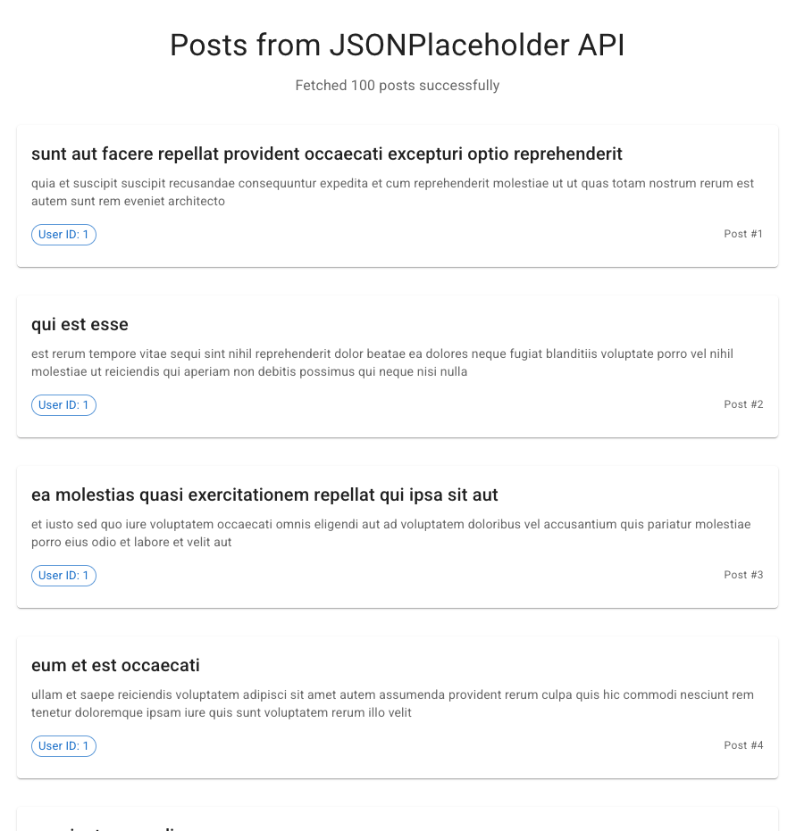

# Instructions for React Take-Home Test

## Getting Started

1. **Navigate to the test directory:**

   ```bash
   cd react-take-home-test
   ```

2. **Install dependencies:**

   ```bash
   npm install
   ```

3. **Start the development server:**

   ```bash
   npm run dev
   ```

4. **Open your browser** and go to `http://localhost:3000`

## Your Task

When you run the completed application, the user should see:

- A loading spinner while the app fetches data from the API
- A list of posts displayed in cards once the data loads
- Each post shows a title, body text, user ID, and post number



_The app displays a list of posts fetched from the JSONPlaceholder API, with Material-UI styling and proper loading states._

Your task is to:

### Option 1: Adjust the current implementation

- Review the code and understand how it works and fill in the blanks
- Update the missing code to get a working implementation

### Option 2: Build Your Own Version

- Create your own implementation from scratch
- Use the same API endpoint: `https://jsonplaceholder.typicode.com/posts`
- Implement the same features but with your own coding style
- You can reference the existing code for guidance

## Key Concepts to Understand

### 1. Component Mounting

- How `useEffect` with empty dependency array works
- When and why components mount/unmount

### 2. API Integration

- How to fetch data from external APIs
- Proper error handling for network requests
- Using async/await patterns

### 3. State Management

- Managing loading, error, and success states
- Using `useState` for local component state
- Proper state updates and immutability

### 4. TypeScript Best Practices

- Interface definitions for data structures
- Proper typing for component props
- Generic types for reusable components

### 5. React Keys

- Why keys are important in lists
- How to choose appropriate key values
- Performance implications of proper key usage

### 6. UI/UX Considerations

- Loading states for better user experience
- Error handling with retry functionality
- Responsive design principles

## Files to Focus On

### Core Implementation

- `src/components/PostList.tsx` - Main component with API integration
- `src/services/api.ts` - API service layer (Optional)
- `src/types/api.ts` - TypeScript interfaces (Optional)

### UI Components

- `src/components/PostCard.tsx` - Individual post display
- `src/components/LoadingSpinner.tsx` - Loading state

### Configuration

- `package.json` - Dependencies and scripts
- `tsconfig.json` - TypeScript configuration

## Bonus Challenges

If you want to demonstrate additional skills, consider:

1. **Add pagination** - Load posts in smaller batches
2. **Implement search** - Filter posts by title or content
3. **Add sorting** - Sort posts by different criteria
4. **Create unit tests** - Test the components and API service
5. **Add animations** - Smooth transitions between states
6. **Implement caching** - Cache API responses to avoid redundant requests

## What We're Looking For

### Technical Skills

- ✅ Proper React hooks usage
- ✅ TypeScript implementation
- ✅ API integration
- ✅ Loading state management

### Code Quality

- ✅ Clean, readable code
- ✅ Proper component structure
- ✅ Good naming conventions
- ✅ Comments and documentation

### Problem Solving

- ✅ Understanding of requirements
- ✅ Logical implementation approach
- ✅ Handling edge cases
- ✅ Performance considerations

## Questions to Prepare For

During your interview, be ready to discuss:

1. **Why did you choose this approach?**
2. **How would you handle larger datasets?**
3. **What would you change for production use?**
4. **How would you test this application?**
5. **How would you handle authentication if needed?**

## Submission

When you're ready to submit:

1. Make sure your code runs without errors
2. Test the application thoroughly
3. Be prepared to walk through your implementation
4. Have questions ready about the codebase

Good luck! 🚀
